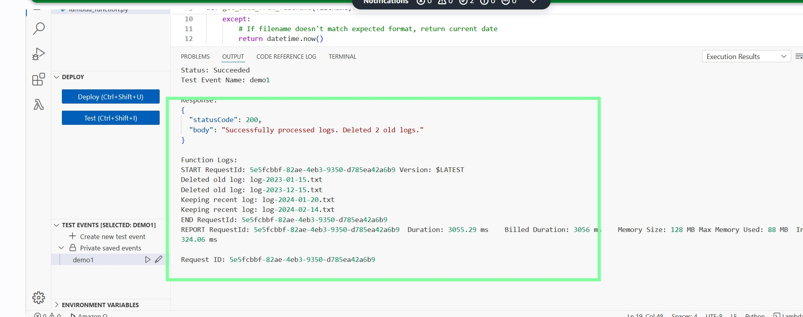

# Assignment #01 :EC2 Auto Start/Stop Lambda Function

Automatically manage EC2 instances based on tags using AWS Lambda.

## Setup

### Create two EC2 instances:
   - Tag one as `Name: Auto-Stop-Ankit`
   - Tag other as `Name: Auto-Start-Ankit`

### Create Lambda IAM role with EC2 permissions
1. Navigate to IAM Console:
   - Go to AWS Console → IAM → Roles → Create Role

2. Create Lambda Role:
   - Choose AWS Service as trusted entity
   - Select "Lambda" as use case
   - Click "Next"

3. Add Permissions:
   - Search for "AmazonEC2FullAccess"
   - Select the policy
   - Click "Next"

4. Configure Role:
   - Name: "boto-ankit-start-stop-ec2"
   - Description: "Allows Lambda to control EC2 instances"
   - Click "Create role"

### Create Lambda function:
   - Use Python 3.x runtime
   - Assign IAM role

## Lambda Function

- Uses Boto3 to write a code that:
  - Describe tagged instances
  - Stop `Auto-Stop-Ankit` instances
  - Start `Auto-Start-Ankit` instances
  - Log affected instance IDs

- Deploy the code in Lambda
  





## Testing
1. Open Lambda Console:
   - Navigate to AWS Console → Lambda
   - Select your function

2. Test Tab:
   - Click "Test" tab
   - Click "Test" button
   OR
   - Click "Configure test event" if first time


----------------------------------------------------------------------------------------------------------------------------------------------------------------------

# Assignment #16: EC2 Disk Space Monitoring System

A serverless solution to monitor EC2 instance disk space utilization and send alerts when usage exceeds 85%.

## Architecture Overview
![Architecture Diagram]
[Include the ASCII diagram we discussed earlier]

## Components
1. **Lambda Function**: Main controller that orchestrates disk space monitoring
2. **Systems Manager (SSM)**: Bridge between Lambda and EC2
3. **EC2 Instance**: Server being monitored
4. **SNS**: Alert notification system
5. **IAM Roles**: Security permissions management

## Prerequisites
- AWS Account
- Appropriate IAM permissions
- Basic knowledge of AWS services

## Installation Steps

### 1. SNS Topic Setup
1. Navigate to SNS service in AWS Console
2. Create a standard topic named "EC2-DiskSpace-Alert"
3. Create subscription:
   - Protocol: Email
   - Configure endpoint
   - Confirm subscription via email

### 2. IAM Roles Configuration

#### Lambda Role
1. Create role with AWS Service > Lambda
2. Attach policies:
   - AWSLambdaBasicExecutionRole
   - AmazonEC2ReadOnlyAccess
   - AmazonSSMReadOnlyAccess
   - AmazonSNSFullAccess
3. Name: "Lambda-EC2-DiskSpace-Monitor"

#### EC2 Role
1. Create role with AWS Service > EC2
2. Attach policy: AmazonSSMFullAccess
3. Name: "EC2-SSM-Role"

### 3. EC2 Instance Setup
1. Launch EC2 instance
2. Configure:
   - Name: "Test-Disk-Monitor"
   - AMI: Ubuntu
   - Type: t2.micro
   - In Advanced details, scroll to "IAM instance profile" and create a new role with AmazonSSMFullAccess policy (this is needed for Systems Manager)


### 4. Lambda Function Setup
1. Create new Lambda function
2. Configure:
   - Runtime: Python 3.9
   - Architecture: x86_64
   - Role: Lambda-EC2-DiskSpace-Monitor
3. Set Environment Variables:
   - Key: SNS_TOPIC_ARN
   - Value: [Your SNS Topic ARN]
4. Update function timeout to 1 minute
5. Increase memory to 256 MB

### 5. Additional IAM Permissions
Add inline policy to Lambda role:
```json
{
    "Version": "2012-10-17",
    "Statement": [
        {
            "Effect": "Allow",
            "Action": [
                "ssm:SendCommand",
                "ssm:GetCommandInvocation"
            ],
            "Resource": [
                "arn:aws:ssm:*:*:document/AWS-RunShellScript",
                "arn:aws:ec2:*:*:instance/*"
            ]
        }
    ]
}
```

### 6. Testing

1. Go to Systems Manager Console
2. Click on "Session Manager" in the left panel
3. Click "Start Session"
4. Select your instance and click "Start Session" 

```
# Check current disk usage
df -h

# Create a large file (this will create a 5GB file)
sudo dd if=/dev/zero of=/large_file bs=1M count=5000

# Check disk usage again
df -h
```

### 7. Notes

1. **Lambda Function**
   - Acts as the main controller/orchestrator
   - Runs our Python code
   - Initiates disk space checks
   - Makes decisions about sending alerts
   - Like a manager overseeing the whole process

2. **Systems Manager (SSM)**
   - Works as a bridge/intermediary
   - Allows Lambda to communicate with EC2
   - Executes commands on EC2 (df -h command in our case)
   - Returns results back to Lambda
   - Like a messenger between Lambda and EC2

3. **EC2 Instance**
   - The actual server being monitored
   - Runs SSM Agent to receive commands
   - Executes disk space check command
   - Reports disk usage back
   - Like a worker being monitored

4. **SNS (Simple Notification Service)**
   - Handles the alerting system
   - Receives alert messages from Lambda
   - Sends email notifications
   - Like a notification dispatcher

5. **IAM Roles**
   - Provides security permissions
   - Lambda Role: Allows Lambda to use SSM and SNS
   - EC2 Role: Allows EC2 to communicate with SSM
   - Like security passes/badges that allow services to work together
  

----------------------------------------------------------------------------------------------------------------------------------------------------------------------------------------------------------------------------------------------------------------------------------------------------------------------------------------------------------


# Assignment #17: EC2 Instance Restore from Snapshot - Lambda Function

A simple AWS Lambda function to restore EC2 instances from their most recent snapshots.

## IAM Role Setup

1. Go to IAM Console
   ```
   https://console.aws.amazon.com/iam/
   ```

2. Create Role:
   - Click "Roles" → "Create role"
   - Select "AWS service" and choose "Lambda"
   - Click "Next"

3. Attach Policies:
   - Search and select:
     - "AWSLambdaBasicExecutionRole"
     - "AmazonEC2FullAccess"
   - Click "Next"

4. Name the Role:
   - Role name: "EC2SnapshotRestoreRole"
   - Description: "Allows Lambda to restore EC2 from snapshots"
   - Click "Create role"

## Lambda Function

1. Create Function:
   - Go to Lambda Console
   - Click "Create function"
   - Name: "EC2RestoreFromSnapshot"
   - Runtime: Python 3.12
   - Role: Select "EC2SnapshotRestoreRole"

2. Add the Code

## Usage

1. Update Instance IDs:
   - Replace instance IDs in the code with your own
   ```python
   instance_ids = ['your-instance-id-1']
   ```

2. Deploy:
   - Click "Deploy" in Lambda console

3. Test:
   - Click "Test"
   - Create new test event with empty JSON `{}`
   - Run test

## Notes

- Function creates t2.micro instances by default
- Uses default VPC and security group
- Creates instances in the first available AZ
- Names instances with pattern: "Restored-{original-id}-{timestamp}"
- Requires snapshots to be tagged with original instance ID

## Troubleshooting

Common errors:
- "No snapshots found": Check if snapshots exist and are properly tagged
- "VPC not found": Ensure default VPC exists in the region
- "Permission denied": Verify IAM role has correct permissions


---------------------------------------------------------------------------------------------------------------------------------------------------------------------------------------------------------------------------------------------------------------------------------------------------------------------------------------------------------

# Assignment #15 : S3 Log Cleanup Lambda Function

## Overview
This project implements an AWS Lambda function that automatically cleans up log files in an S3 bucket based on the date in their filenames. Files from previous years are automatically deleted while current year files are retained.

## Components
- **AWS Lambda**: Executes the cleanup logic
- **Amazon S3**: Stores the log files
- **IAM Role**: Provides necessary permissions for Lambda to interact with S3

## Setup Instructions

### 1. S3 Bucket Creation
```bash
# Create an S3 bucket for storing logs
Bucket Name: demo-logs-cleanup-2025-ankit
Region: ap-south-1
```

### 2. IAM Role Configuration
Create an IAM role with the following policies:
- AWSLambdaBasicExecutionRole
- AmazonS3FullAccess

### 3. Lambda Function Setup
- **Name**: S3LogCleanup
- **Runtime**: Python 3.13
- **Handler**: lambda_handler
- **Memory**: 128 MB
- **Timeout**: 3 minutes
- **Role**: S3LogCleanupRole

## Testing

### Sample Log Files
Create test log files following this naming convention:
```
log-YYYY-MM-DD.txt
```

Example:
- log-2023-01-15.txt
- log-2023-12-15.txt
- log-2024-01-20.txt
- log-2024-02-14.txt

### Expected Results
- Files from 2023 will be deleted
- Files from 2024 will be retained

## Deployment Steps
1. Create S3 bucket
2. Create IAM role
3. Create Lambda function
4. Upload test files
5. Run Lambda function
6. Verify results in the S3 bucket
